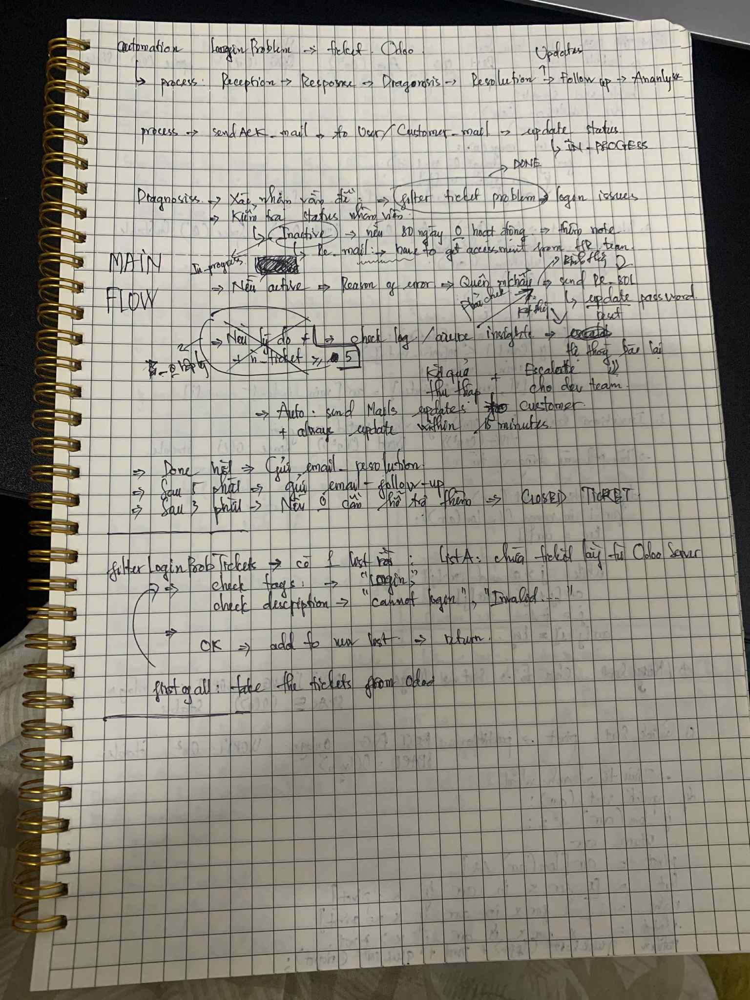

## This doc will explain the whole process of automation in responding to customer by ticket Odoo, following the MindX Process

Based on the given process,

```bash
Reception -> Responses -> Diagnosis -> Resolution -> Updates -> Follow-up -> Analysis
```

I've built in a automation script that handle the login problem. 

## The plan I had made was: Polling the data from Odoo DB

I created a worker that have an abilitty of taking the data which related to the login issue; In the next step, they can handle the given process, such as: sending ACK mail to users, sending resolution email, and follow-up email.

Before sending the re_mail and follow-up_mail, the worker will check the status of customer who raised the ticket whether his/her account is active or not. If their account was deactive, the worker would send an email for them with the subject like: Requesting for the authority. On the other hand, the worker will check the metrics insight (azure, logs, odoo, and db) after sending ACK mail and checking the status. The reason why I did it is in some cases, it could be the system error if the metric was unstable. As a result, I could make a decision about escalate to dev team or not.

In the final steps, sending a re_mail to customer with a temporary solution. It could be a resetting password template or a workaround.



## Setup

```env
ODOO_URL=https://company.odoo.com
ODOO_DB=mydb
ODOO_USERNAME=api_user
ODOO_PASSWORD=xxxx
```

How to run:
```bash
npm run start
```

OR
```bash
npx ts-node index_worker.ts tickets 
```


